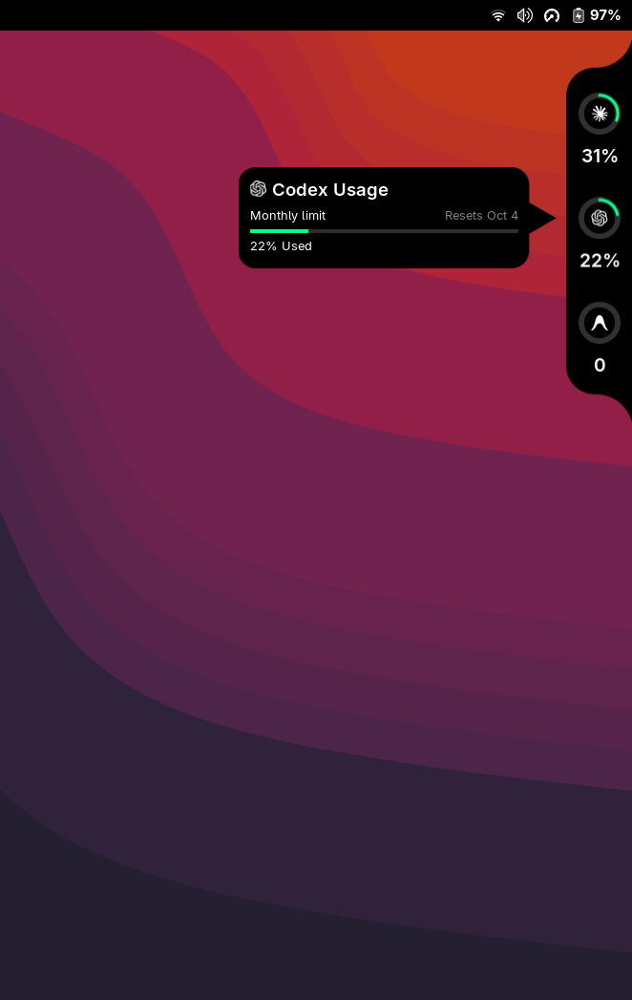
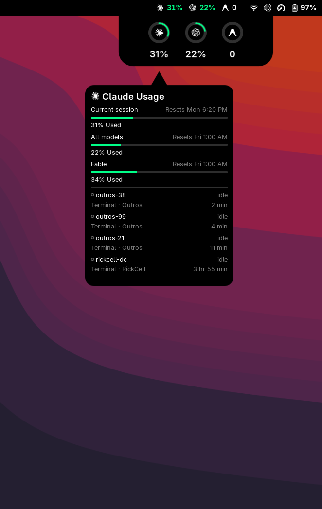

# Codenotch for GNOME

A black notch welded to the right edge of the screen that shows, at a glance,
how much of each coding assistant's usage limit you have burned. A GNOME Shell
port of [vinzdg/codenotch](https://github.com/vinzdg/codenotch) (macOS,
Swift), keeping its geometry, palette and motion.

At rest it is a thin pill on the screen edge. Hover it and it unfolds into a
stack of provider rings; hover a ring and a card slides out with every limit
window, when each resets, and the Claude Code sessions running right now.
Spinning arcs inside a ring mean that tool is working; a pulsing ring means it
is waiting on you.

<p align="center">
  
  
</p>

Left: the edge notch, unfolded, with a provider card. Right: the top panel
indicator with the notch dropped out of the panel.

## Providers

Codenotch never signs in anywhere. Every reading is borrowed from a credential
a tool on this machine already holds, and a provider only gets a cell when that
credential exists.

| Provider | Credential read | Usage endpoint |
|----------|-----------------|----------------|
| Claude Code | `~/.claude/.credentials.json` | `api.anthropic.com/api/oauth/usage` |
| Codex CLI | `~/.codex/auth.json` | `chatgpt.com/backend-api/wham/usage` |
| Antigravity (`agy`) | GNOME keyring, service `gemini` / `antigravity` | `cloudcode-pa.googleapis.com/v1internal:retrieveUserQuotaSummary` |
| Grok CLI | `~/.grok/auth.json` | `cli-chat-proxy.grok.com/v1/billing` |

Tokens are read only, never refreshed or written. If one expires, the card
says so and the tool itself refreshes it on its next run.

Antigravity only answers the quota endpoint for an account licensed for it.
Without that licence there is no published limit to be a fraction of, so the
card counts the requests `agy` logged today from its own transcripts under
`~/.gemini/antigravity-cli/brain/` and marks the number with a `~`. Its access
token lives one hour and only `agy` renews it; the notch never does, so an hour
after the last `agy` run the card says the sign-in expired and falls back to
that local count.

Grok's billing endpoint answers for every account, but it only states numbers
where something is metered; an account with no published allowance gets zeros
back, and the card counts the turns `grok` closed today in its session logs
under `~/.grok/sessions/` instead, marked with a `~`. The CLI refreshes its own
six-hour token, so an expired sign-in is not a failure here either: the card
says so and falls back to that same local count.

Usage is read every minute only while a tool is active and every five
minutes otherwise; unfolding the notch never triggers a read. The last
reading is remembered in `~/.cache/codenotch/` and shown (dimmed after
fifteen minutes) when a read fails.

## Install

```sh
./dev/install.sh
```

This copies the extension into `~/.local/share/gnome-shell/extensions/`, so
the checkout can be moved or deleted afterwards. Run it again after pulling
changes, then reload from the preferences window.

On Wayland the shell only discovers new extension directories at login, so
the first enable may need a log out and back in.

### Reloading

After that first login no edit needs another one. `extension.js` is only a
loader: it copies the source into a fresh directory under
`~/.cache/codenotch/live/` and imports from there, so the "Recarregar
extensão" button at the bottom of the preferences (or `dev/reload.sh`)
reloads everything except `extension.js` and `prefs.js` themselves. Those two
still need a re-login (or `Alt+F2`, `r` on X11). The loader stages the
working tree exactly as it is on disk, so reload after committing (or at
least after saving a consistent state), not while files are mid-edit.

Requires GNOME Shell 48 or newer.

## Preferences

Open them from the Extensions app or with `gnome-extensions prefs codenotch-gnome`.

- **Onde mostrar**: the edge notch, an indicator in the top panel — each
  tool's logo and percent, next to the battery; hovering it drops a notch out
  of the panel with the rings and the card, a click pins it open and Escape or
  another click closes it — or both at once. The readings are shared, so a
  second surface costs no extra API calls.
- **Posição**: which screen edge the notch is welded to (right, left, top,
  bottom) and where along that edge it sits. A top notch hangs below the
  panel; a bottom one rests on the dock.
- **Ferramentas**: which tools appear, each with its own on/off switch.
- **Aparência**: body colour, body opacity, overall size, text size, and
  whether the percent label shows under each ring. Rings and glyphs never
  change colour.
- **Comportamento**: how wide the strip along the edge that opens the notch
  is (4 px by default, so things beside a folded notch stay clickable) and
  how long the pointer must dwell there; keep the notch always unfolded;
  hide it while a window is fullscreen; how often usage is read.

Every change rebuilds the surface in place; nothing needs a restart.

## Development

`dev/nested.sh` runs a headless GNOME Shell with only this extension enabled
and has the extension photograph itself at rest, unfolded, and with each
provider's card open. Screenshots land in `dev/out/`. Settings can be
injected as keyfile lines; `dev/prefs-shot.sh` opens the preferences window
inside that shell and photographs it too.

```sh
./dev/nested.sh
NESTED_SETTINGS=$'edge=\'top\'\nopacity=0.7' ./dev/nested.sh dev/out-top
./dev/prefs-shot.sh
```

The schema in `schemas/` must be compiled after editing:
`glib-compile-schemas codenotch-gnome/schemas/`.

Layout constants live in `layout.js` and are the design frame's measurements
scaled so the ring is 44 px; change nothing there without a ruler.

## Not ported (yet)

- Cursor, GLM and OpenCode providers.
- The settings orb; preferences live in a normal GNOME preferences window.
- Codex session activity (it lives in a SQLite file).

## Credits

A port of [Codenotch](https://github.com/vinzdg/codenotch) by vinzdg, which
is where the idea, the design frame every number here is measured from, the
palette and the traced provider marks come from. Both projects are MIT
licensed; see [LICENSE](LICENSE).
